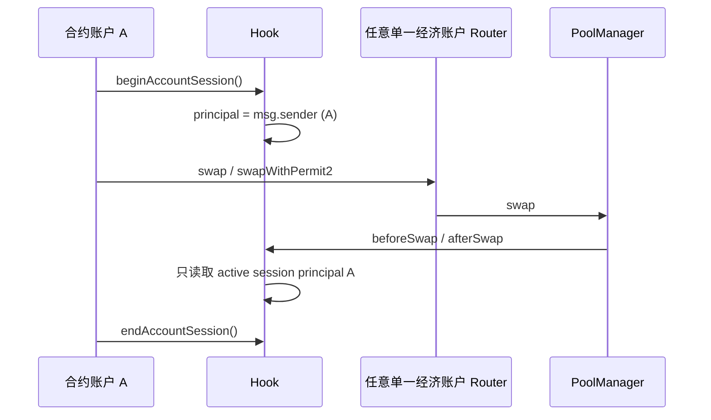
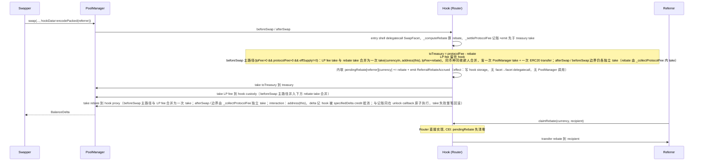
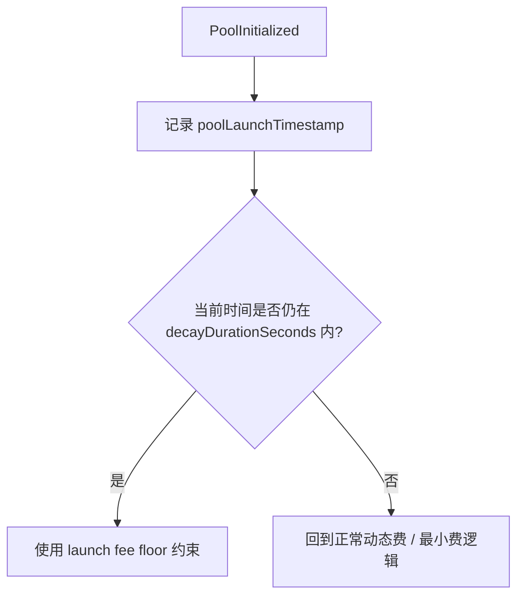
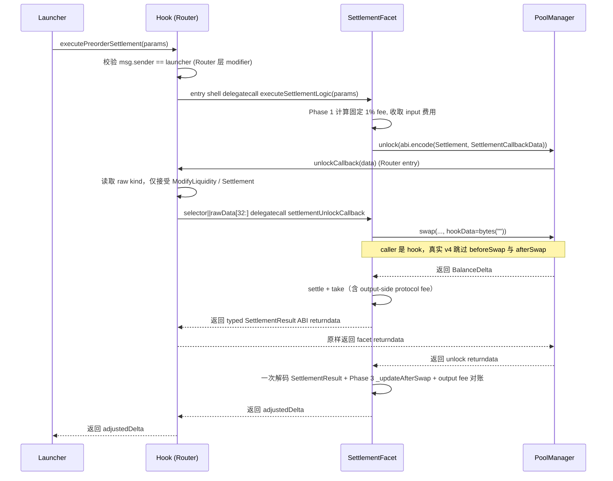
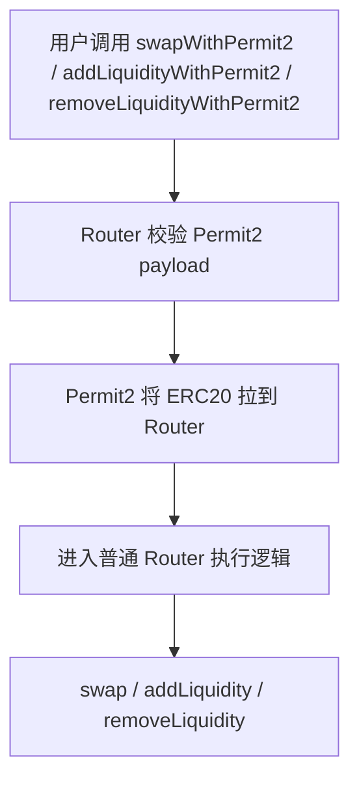
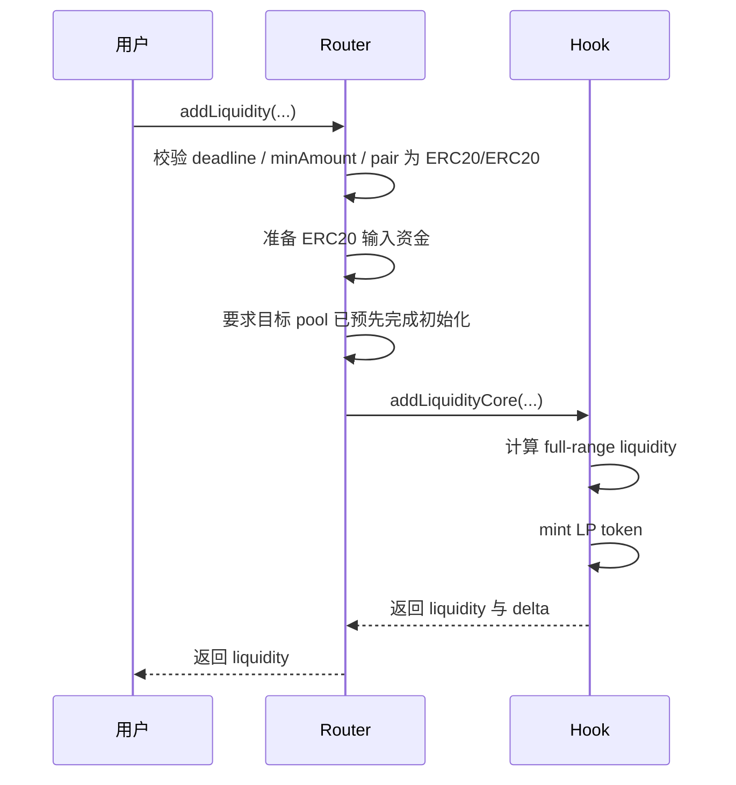
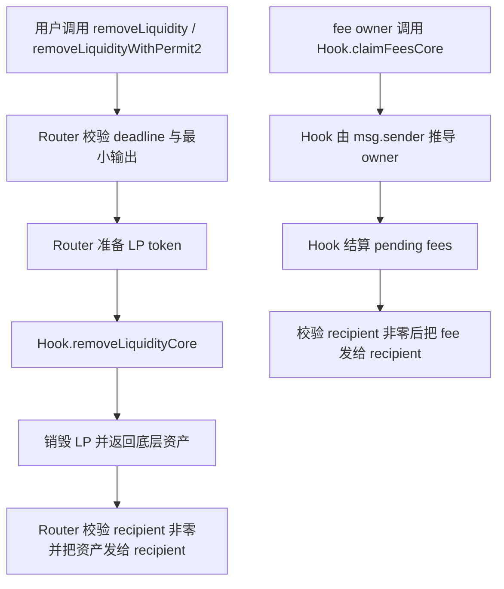
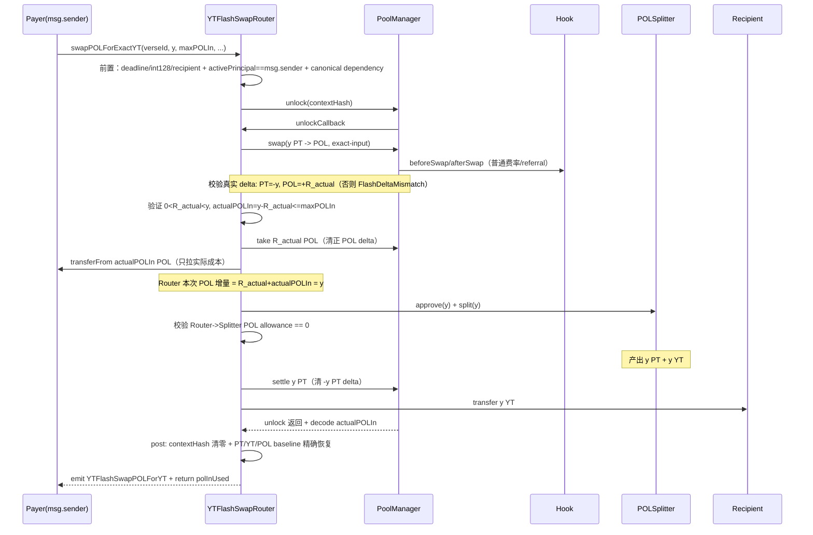
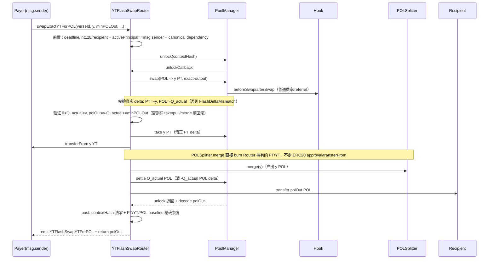

# Memeverse Swap 流程图

本文档聚焦当前 `swap`、`preorder settlement` 与 LP 主路径的执行与资金流，不展开治理、部署与链下流程。
其中资金准备既可来自常规 approve 路径，也可来自 `*WithPermit2(...)`。

相关实现主要位于：

- `src/swap/MemeverseSwapRouter.sol`
- `src/swap/MemeverseUniswapHook.sol`
- `src/swap/SwapFacet.sol` / `src/swap/DynamicFeeFacet.sol` / `src/swap/SettlementFacet.sol`（diamond facet，经 Router entry `delegatecall` 分发，共享 hook storage；详见 §1.1 / §3）

---

## 1. 总体交易执行流

Router 调用 PoolManager、PoolManager 回调 Hook 的入口顺序，以及图中普通动态 Swap 的一次选费与最终用户 delta 结算，均为当前实现事实。`[代码已证]`

### 1.0 Smart EOA transient session 交易流 `[代码已证]`



- `begin -> Router -> end` 必须由 `A` 在同一不可捕获、全成全败的执行 frame 内完成；Hook callback 只使用 session context 的 principal。
- 普通未升级 EOA、外部 `BatchExecutor` 与多用户 batch Router 不在支持范围内。

```mermaid
flowchart TD
    A[用户调用 Router.swap / swapWithPermit2] --> B[Router 基础校验]
    B --> B1{currency0 或 currency1 是否为 address(0)?}
    B1 -- 是 --> BX[revert NativeCurrencyUnsupported]
    B1 -- 否 --> C[准备 ERC20 输入资金]
    C --> B2{recipient 是否为 address(0)?}
    B2 -- 是 --> BY[revert InvalidRecipient]
    B2 -- 否 --> D[调用 PoolManager.swap]
    D --> E[Hook.beforeSwap]
    E --> F[按原始用户请求一次选择动态费]
    F --> G[PoolManager 完成 swap]
    G --> H[Hook.afterSwap]
    H --> I[Router 做 minOut / maxIn 校验]
    I --> K[返回 BalanceDelta]
```

说明：

- 普通 swap 采用单路径结算，execute-or-revert（V10 定义见 [docs/spec/swap/uniswap-v4.md](uniswap-v4.md) §4）。
- swap 栈只支持 ERC20/ERC20 pair；native 拒绝规则（V5）与收费/币种边界见 [docs/spec/swap/uniswap-v4.md](uniswap-v4.md) §3。
- 启动期保护通过 Hook 内的 `launch fee window` 费率逻辑体现。

### 1.1 普通动态 Swap 的费用与 delta 流 `[代码已证]`

> **非规范流程摘要。** 精确的一次选费、四路径、raw `sqrtPriceLimitX96`、全范围容量、核心/最终用户 delta 与拒绝规则均以 [uniswap-v4.md §3.1–§3.2](uniswap-v4.md) 为唯一 canonical；本节与其发生任何不一致时，以该 canonical 为准。

对流程读者而言，`beforeSwap` 在普通动态路径开始时准备本笔 swap 的费用与核心执行上下文；PoolManager 完成核心 swap 后将实际核心 delta 交给 `afterSwap` 进行后续结算；Hook 调整后的最终用户 delta 返回 Router，由 Router 完成用户侧预算检查并返回结果。固定 fee 与 preorder settlement 不复用此普通动态流程。

### 1.2 返佣资金流（Referral Rebate）

普通 swap 携带 referrer 且收取 protocol fee 时，SwapFacet 的返佣处理按收费入口分流：满足合并领取条件的 `beforeSwap` 路径直接执行 `_computeRebate` 与 `_settleProtocolFee`，并将 LP fee 与 rebate 合并为一次 `PoolManager.take` 至 hook proxy；其余仍收取 protocol fee 的 `beforeSwap` 分支，以及 `afterSwap` 的 protocol-fee 路径，经 `_collectProtocolFee` 处理，rebate 非零时单独 `take`。rebate custody 在 hook proxy（`address(this)` 在 delegatecall 下为 hook proxy），`pendingRebate` 账本在 Router storage。



说明：

- **rebate custody 在 hook proxy**：`MemeverseUniswapHook` 的 callback/fee logic 由 SwapFacet / DynamicFeeFacet 经 Router entry `delegatecall` 执行并共享 Router storage。rebate `take` recipient = `address(this)`（hook proxy），`pendingRebate` 在 Router storage，`claimRebate`/`pendingRebateOf` 入口在 hook。
- **rebate currency = 该 swap protocol fee 的 currency**：由 `protocolFeeOnInput`（输入侧优先，否则输出侧；两侧均未注册的普通池落输入侧）决定；rebate 与 protocol fee 同币种（in-kind）。LP fee 始终位于输入侧（currencyIn），与 protocolFeeOnInput 无关。无 referrer 时不切 rebate，protocol 收全额 35%。
- **claimRebate 在 hook 可调**：`MemeverseUniswapHook::claimRebate(currency, recipient)`（Router 直接实现）；hook 持有的 token 余额偿付能力见 [docs/spec/invariants.md](../invariants.md) INV-20。
- **preorder settlement 路径不携带 referrer，不参与返佣**：`executePreorderSettlement` 走 `Launcher -> Hook -> SettlementFacet`（Router entry `delegatecall`，见 §3），`hookData = bytes("")`，普通 swap 的返佣路径（beforeSwap 主路径 `_computeRebate` + 合并 take，及 beforeSwap 边界 / afterSwap 的 `_collectProtocolFee`）均不触发，protocol 收全额固定 fee 不切 rebate。

---

## 2. 启动期费率窗口



说明：

- 新池初始化后会记录 `poolLaunchTimestamp`。
- 在衰减窗口内，fee 从 `startFeeBps` 逐步下降到 `minFeeBps`。
- 窗口结束后，回到常规动态费与最小费逻辑。

---

## 3. Preorder Settlement 显式通道

> typed unlock payload、raw discriminator 路由、typed returndata 与 v4 self-call callback skip 均已实现。`[代码已证]`



说明：

- 这条路径不是普通用户路径。
- 启动结算直接进入 Hook Router，由 typed discriminator 路由到 SettlementFacet；不经过 `MemeverseSwapRouter` 普通 swap 通道。
- Settlement logic 经 Router entry `delegatecall` SettlementFacet 执行。unlock payload 直接使用 `abi.encode(UnlockCallbackKind.Settlement, SettlementCallbackData)`；Router 只对当前支持的 raw discriminator 分支，未知值回退 `InvalidUnlockCallbackKind(rawKind)`。因 `SettlementCallbackData` 当前全静态，kind 校验后用 `bytes.concat(settlementUnlockCallback.selector, rawData[32:])` 前缀转发到 facet（跳过 memory decode + 二次 encode）。typed facet returndata 由 Router 原样返回，外层 settlement logic 只解码一次。若 `SettlementCallbackData` 未来引入动态字段，须回到 `abi.encodeCall`。
- settlement swap 是 hook self-call，真实 v4 同时跳过 `beforeSwap` / `afterSwap`；不需要 settlement transient routing flag。回调型 token 发起的**跨池**外部重入 swap 不是 hook self-call，仍执行普通 callbacks 并走 public fee 正常收费；**同池**生命周期重入（公开 swap 路径下由 outer `beforeSwapLogic` 持有该池 per-pool transient lock，回调内再次进入同池 `beforeSwapLogic` 触发 `SwapLifecycleReentrant`）被阻断，防止 callback token 在 outer 报价固定后推进动态费 state 造成费率失真；settlement self-call 因 v4 跳过 `beforeSwap`/`afterSwap` 不进这两个函数的 acquire/release 路径，故 settlement 路径下改由 `SettlementFacet.executeSettlementLogic` 在 Phase 1 `transferFrom` 前 acquire、Phase 3 `_updateAfterSwap` 后的函数末尾 release 同一 per-pool lock，覆盖 callback token 在 transferFrom 窗口（Phase 1/2，pre-unlock）与 settle/take transfer 期间对同池发起的 reentrant swap（见 [docs/spec/invariants.md](../invariants.md) INV-04A）。需注意在 no-session settlement 路径上该重入 swap 进入 `beforeSwapLogic` 后先命中 INV-23 session 门（`activePrincipal() == address(0)` 即回退 `AccountSessionNotActive`，早于 `_revertIfPublicSwapBlocked` 与 `acquireSwapLifecycleLock`），故前述 `SwapLifecycleReentrant` 选择子仅在「重入 swap 发生时 session 已 active」的公开 swap 路径下成立，settlement 无 session 路径由该 session 门更早阻断（只是选择子更早、不同）。
- 该路径使用固定总费（数值定义见 [docs/spec/verse/accounting.md §7.4](../verse/accounting.md)）；caller 约束见 [docs/spec/invariants.md](../invariants.md) INV-04。不复用普通动态费结果。
- **资金与 approve 路径**：Launcher 只需对 Hook 做一次 infinite approve。Hook 作为 `transferFrom` 的 spender，拉取 protocol fee 到 treasury，并把 netInput 与 LP fee 合并一次 `transferFrom` 拉到 hook proxy custody（同源同收款人，省一次 ERC20 transferFrom）；SettlementFacet 用 hook proxy 余额直接 `transfer` 给 PoolManager，不需要任何 approve。详见 [docs/spec/swap/swap-integration.md §5.1](swap-integration.md)。

---

## 4. Permit2 并行资金流



说明：

- Permit2 只改变 ERC20 资金准备方式；Permit2 入口语义（V6）见 [docs/spec/swap/permit2.md](permit2.md)。
- 一旦资金到达 Router，后续业务语义与普通入口完全一致。
- native 拒绝（V5）见 [docs/spec/swap/uniswap-v4.md](uniswap-v4.md) §3。

---

## 5. Add Liquidity 主路径



说明：

- `addLiquidity(...)` / `addLiquidityCore(...)` 不负责初始化 pool，调用前目标 pool 必须已经存在且已初始化。
- 初始建池路径为 `Launcher -> Router.createPoolAndAddLiquidity(...)`。
- bootstrap 由 `Launcher` 先给出 desired budgets，再由 Router 执行 `createPoolAndAddLiquidity(...)`；对外记账真源是实际执行后的 actual spend / actual liquidity。

### 5.1 Bootstrap Execution

- 集成契约：Router 从 Launcher 提交的 desired budgets 执行 `createPoolAndAddLiquidity(...)`，并把 actual spend / actual liquidity 返回给 Launcher 做后续 accounting（bootstrap 不返回 preview-equality 结果）。
- 四池 bootstrap 的记账语义、`memecoin/uAsset` 主池 PT backing ratio 口径、auxiliary underspend 处置、unused bootstrap `uAsset` / `memecoin` 处置见 [docs/spec/verse/accounting.md](../verse/accounting.md) §3.2 与 [docs/spec/invariants.md](../invariants.md) INV-04；PT backing ratio 的记录与 split 操作语义 home 在 [docs/spec/polend/pt-yt-splitter.md §1](../polend/pt-yt-splitter.md)，不变量锚点见 [docs/spec/invariants.md](../invariants.md) INV-14 / INV-19；unused bootstrap `uAsset` 进入的 settlement dust reserve 结构与处置 home 在 [docs/spec/polend/core.md §6.7](../polend/core.md)，该 reserve 与杠杆侧 PT fee 预兑付的关联见 [docs/spec/polend/settlement-and-fees.md §5](../polend/settlement-and-fees.md)。

---

## 6. Remove Liquidity 与 Claim Fee 主路径



说明：

- 上图中两条路径的 `recipient` 非零 fail-close 规则（V7）见 [docs/spec/invariants.md](../invariants.md) INV-07，不在本文档重述。

---

## 7. 超简版摘要

```mermaid
flowchart TD
    A[普通 swap] --> B[Router 校验]
    B --> C{存在 EWVWAP 历史且交易回归 EWVWAP?}
    C -- 是 --> C1[跳过全部动态费组件<br/>effectiveFee = max(baseFee, launchFee)]
    C -- 否 --> C2[Hook 动态费<br/>adverse per-address + vol per-pool + short per-pool<br/>取 max(dynamicFee, launchFee)]
    C1 --> D[成功则返回 delta，失败则回退]
    C2 --> D

    E[preorder settlement] --> F[Launcher 调 Hook.executePreorderSettlement]
    F --> G[Hook 校验 launcher 绑定]
    G --> H[SettlementFacet delegatecall 执行：收取 input 费用 + unlock/swap/take]
    H --> I[固定 1% 结算]
```

一句话概括：

- 普通 swap：execute-or-revert，启动期靠费率衰减保护
- 特殊启动结算：显式 `Launcher -> Hook -> SettlementFacet`（Router entry `delegatecall`），固定费率（数值见 [docs/spec/verse/accounting.md §7.4](../verse/accounting.md)）

---

## 8. YT Flash Swap 资金流

YT Flash Swap 由独立的 `MemeverseYTFlashSwapRouter` 承载，与 `MemeverseSwapRouter` 相互独立。它复用同一 PT/POL v4 池与 Hook 费率/referral/account-session，但不复用普通 Router 的 Permit2/quote/退款分支。完整 canonical 以 [yt-flash-swap.md](yt-flash-swap.md) 为准；本节给出两条路径的资金流摘要。`[代码已证]`

**核心约束**：真实 `BalanceDelta` 是唯一结算依据，不预拉 `maxPOLIn`，无退款分支；`FlashDeltaMismatch` 只校验真实 delta 的币种/符号/完整成交结构，绝不比较历史 quote。

### 8.1 买入：POL → 精确 YT（一次普通 exact-input PT→POL swap）

设 \(y=exactYTOut\)。底层是普通 exact-input `y PT -> R_actual POL`，真实 delta 必须恰好 `PT=-y, POL=+R_actual`，再 split 补 PT 债务。



要点：

- 只拉 `actualPOLIn`，不预拉 `maxPOLIn`，无退款分支。
- `R_actual == y`（零成本）或 `R_actual > y`（负成本）都 fail closed，不让 unsigned 减法下溢。
- Router→Splitter 的 POL allowance 成功后必须为 0（split 恰好消耗 y，成功路径不调 `approve(0)`）。
- PT/POL 腿的费率、referral、动态状态与对应普通 swap 完全一致且只发生一次。

### 8.2 卖出：精确 YT → POL（一次普通 exact-output POL→PT swap + flash merge）

设 \(y=exactYTIn\)。底层是普通 exact-output `Q_actual POL -> y PT`，真实 delta 必须恰好 `PT=+y, POL=-Q_actual`，再 merge 消掉 PT 并结清 POL 债务。



要点：

- `Q_actual == 0` 或 `Q_actual >= y` 都回滚（避免零债务/负输出/算术下溢）。
- `polOut < minPOLOut` 必须在 take、pull、merge 前原子回滚。
- `merge` 直接 burn Router 持有的 PT/YT，不经 ERC20 approval/transferFrom；不产生第二次 swap。
- PT/POL 腿的费率、referral、动态状态与对应普通 swap 完全一致且只发生一次。
